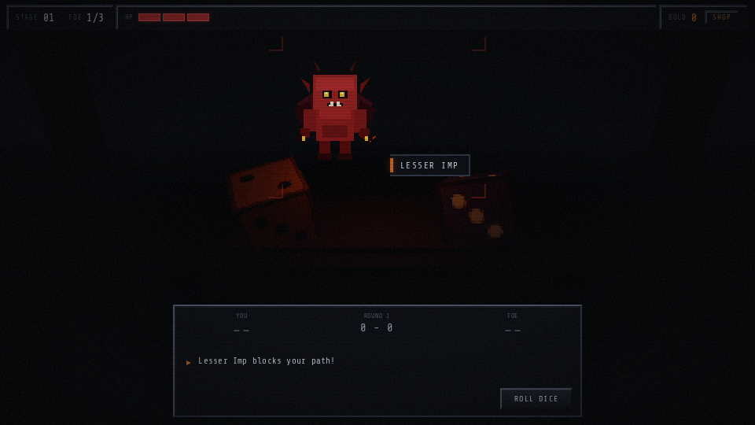

# PDICELAND

A browser-based dark fantasy dice duel. Face demons at a cursed altar, win best-of-three rounds, earn gold at the ruin merchant, and survive as long as you can.

**[Play online](https://padrosum.github.io/pdiceland/)**



## How to play

1. **Roll the dice** — Each duel is best of 3 rounds. Higher roll wins. Ties are re-rolled.
2. **Manage HP** — Lose a duel and you lose 1 HP. At 0 HP, game over.
3. **Earn gold** — Defeat demons for gold. Dominant wins grant bonus multipliers.
4. **Visit the merchant** — Buy potions and heart stones between fights (press **M**).
5. **Clear stages** — Beat 3 demons per stage to advance. Enemies get stronger each stage.

A short **How to Play** tutorial runs when you start a new game (skippable).

## Controls

| Key | Action |
|-----|--------|
| **SPACE** / **ENTER** | Roll dice, continue, confirm menus |
| **M** | Open merchant |
| **ESC** | Close merchant |

## Local development

```bash
npm install
npm run dev
```

Open [http://127.0.0.1:5185](http://127.0.0.1:5185).

```bash
npm run build    # production build
npm run typecheck
```

### Screenshots

Regenerate in-game captures (dev server must be running):

```bash
npm run screenshots
```

### Git hooks (optional)

To block Cursor `Co-authored-by` trailers on local commits:

```bash
git config core.hooksPath .githooks
chmod +x .githooks/prepare-commit-msg
```

Also disable **Agents → Attribution** in Cursor Settings.

## Tech stack

- **Vite** + **TypeScript**
- **Three.js** — first-person altar scene, animated dice
- PS2-inspired UI overlay with CRT scanlines

## Audio credits

All sounds are CC0. See [`public/audio/CREDITS.txt`](public/audio/CREDITS.txt).

## License

GPL-3.0-or-later. See [LICENSE](LICENSE).
